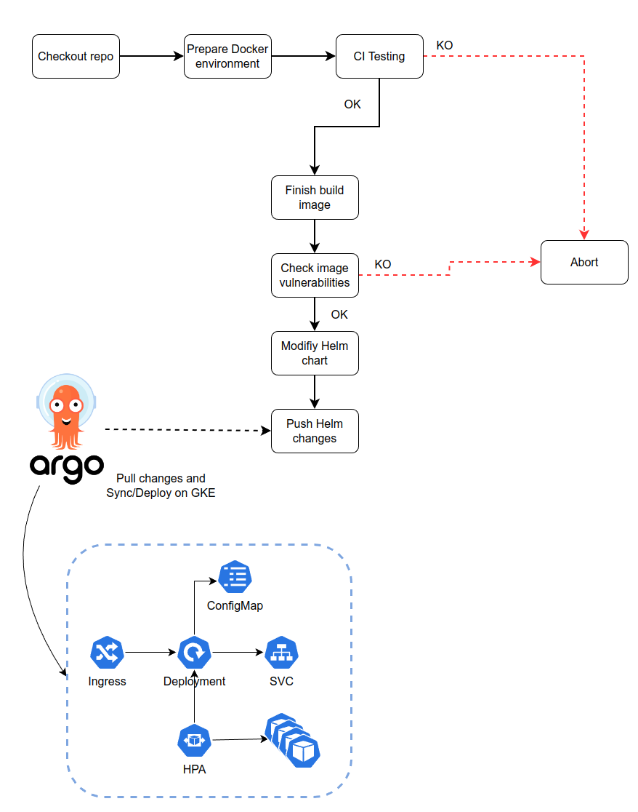

# CI-CD

CI/CD is based in a simple PoC of GitOps:

Pipeline steps:

- Prepare version to build Docker image
- Build Docker image. It includes basic testing (Unit testing must be implemented too) with Flake8
that fails if code is not as good as expected, based on required tests.
- Check base image vulnerabilities with Trivy that aborts pipeline execution if many
vulnerabilities are detected.
- Modify in a simple way (with yq) the version of the image on chart values.yaml.
- ArgoCD, deployed in a GKE cluster, detects the changes on the manifests.

Further steps that can be improved specifically on CI/CD:

- Add more that one environment, at least 3 (develop/PRE/PRO).
- GitOps repositories with helm chart, one per environment.
- PR/Branch protection rules at repo level.
- Change the deployment strategy to BlueGreen or Canary if required.
- Using the CRDs of ArgoCD, implement Pre/Post Analysis to abort deployments if the AnalysisTemplates are
not working as expected.
- Automatic LoadTesting with K6 + TestKube on PRE environment.
- Improve Docker image weight and Dockerfile itself with useful metadata.
- Multiple branches working with GitHub Flow for deployments.
- ... (Open to discuss)