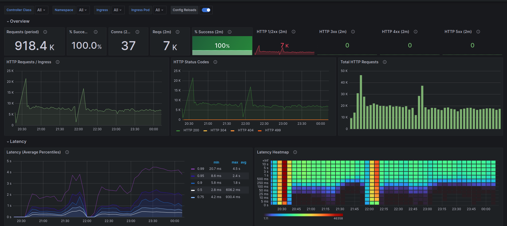

# SRE Considerations

Stack:

- FluentBit
- Prometheus
- Grafana
- Code instrumentation

This app has been deployed using the Nginx ingress controller as main ingress. It exports the different
metrics about it to have a good point of view about SLI/Os information. Prometheus consumes the different 
metrics from the Ingress and the API itself brings an specific endpoint to give useful metrics to prepare
more granular dashboards on Grafana and implement alerting with:

https://github.com/slok/sloth

The main idea is to provision the basic monitoring based on RED/USE metrics with Prometheus Node Exporter for USE
and code instrumentation/Ingress Controller Metrics/Service Mesh for RED.

Deployed dashboard on Grafana with Nginx Ingress metrics:

SRE considerations:

- SLI/O must be prepared via Prometheus stack (Prometheus + AlertManager + Grafana) and the alerting
of budget consumption should trigger alerts using Sloth as alert provider for alert manager in small periods
of time, depending on the xN ratio of error budget consumption.
- When a deployment is done, alerting should be adjusted to abort deployment if necessary via K8s operator + ArgoCD
to allow automatic rollback if budget consumption is consumed too fast with the new release.
- The SLI/Os **must** be documented on a repository that can be consumed by all SRE team and reviewed each 2/3 months
to adjust the SLI/Os and Expected ratio of budget consumption.
- SRE should comment with DevOps team (based on monitoring) if another deployment strategy is preferred like Canary or 
BlueGreen (solution provided by ArgoCD)